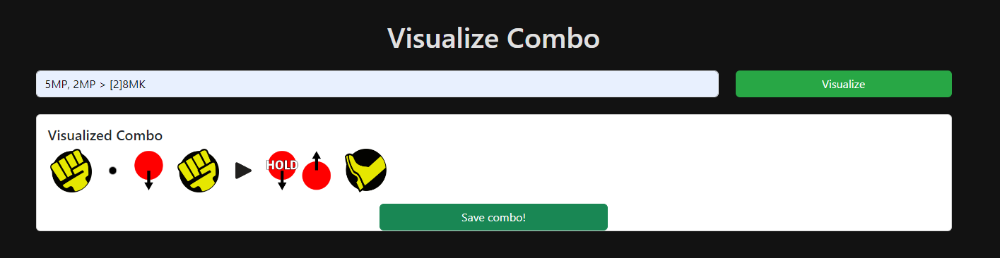
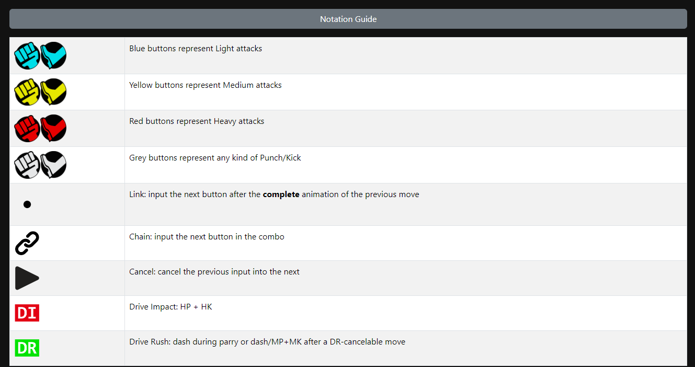
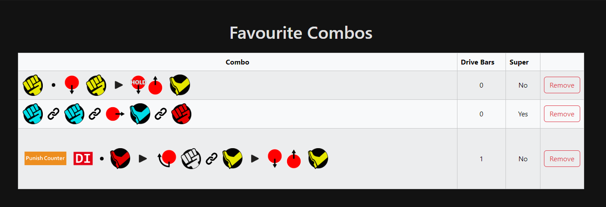

# Combo Visualizer

This is a tool that reads Street Fighter 6 combo strings and displays them using icons similar to those used in Street Fighter 6. My goal is to help players learn combos faster by providing accurate, user-friendly representations of combos. 

I have always found that written combo notations were a little hard to understand, so I hope this might be useful to people.

## How it works

- The user types/pastes a combo
- The user clicks in "Visualize"
- The sytem displays a visual representation of the combo

Given that not all icons are exactly equal to those used in Street Fighter 6, I included a Notation Guide with some basic explanation on the icons that I am using. This list might be expanded in the future.

After the user is logged in, they can save their favourite combos. This can be done by clicking the "Save combo!" button.

The user can later view all favourite combos in the "Saved Combos" page.

## Acknowledgement
Thanks to @TinyTorgue on Twitter/X, for creating the images in this tweet: https://twitter.com/TinyTorgue/status/1727785374540284211 and allowing people to use them.